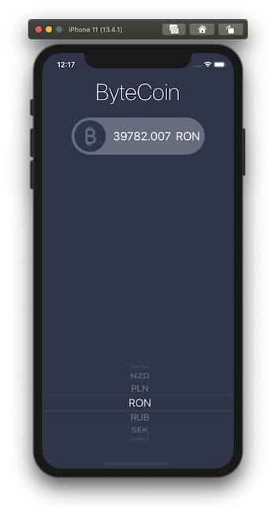
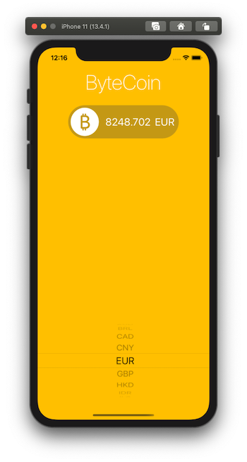

#  ByteCoin - BitCoin Tracker App

## Complete Xcode Application for iOS

## To run on your Xcode

* Swift >= 4
* Xcode >= 10
* Free API Key from [CoinAPI](https://www.coinapi.io/) 

## To Add API key follow the following steps
* Open project in Xode
* In Model Group, open file CoinManager.swift

```
let apiKey = "YOUR_API_KEY"
```
* Replace YOUR_API_KEY in this line.

## Features of this APP
* Dark Mode Support
* Named Colors for Dark/Light mode support
* Display live BitCoin rate

## Swift Concepts Implemented
* Delegated and Protocols
* Extensions
* URL Sessions and Networking (API)

## App Preview

Dark Mode



Light Mode



## Note:
As I developed this app while learning, you can suggest new features in it, idea to make the code readabilty better.